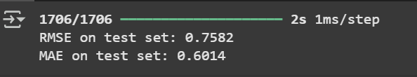

# Laporan Proyek Machine Learning - Muhammad Daffa Nurahman

## Project Overview
Di era digital saat ini, volume informasi yang tersedia secara daring semakin meningkat secara eksponensial. Hal ini menyebabkan tantangan baru bagi pengguna dalam memilih informasi atau produk yang sesuai dengan preferensi mereka. Untuk mengatasi hal tersebut, sistem rekomendasi (recommender system) telah menjadi komponen penting dalam berbagai platform digital, seperti layanan streaming film (Netflix), e-commerce (Tokopedia, Amazon), hingga media sosial (YouTube, TikTok).Salah satu domain yang paling populer dalam penerapan sistem rekomendasi adalah industri hiburan, khususnya layanan penyedia film. Sistem rekomendasi pada platform ini membantu pengguna menemukan film yang relevan dengan minat mereka tanpa harus mencarinya secara manual. MovieLens, sebagai salah satu dataset paling umum dan banyak digunakan dalam penelitian sistem rekomendasi, menyediakan data rating film yang diberikan oleh pengguna serta metadata film seperti genre dan judul. Dengan menggunakan dataset ini, kita dapat mengeksplorasi berbagai pendekatan sistem rekomendasi, termasuk Collaborative Filtering (CF) dan Content-Based Filtering (CBF).

Pendekatan Collaborative Filtering (CF) bekerja berdasarkan kesamaan pola rating antar pengguna, tanpa melihat isi atau karakteristik item. Sedangkan Content-Based Filtering (CBF) memberikan rekomendasi berdasarkan kemiripan karakteristik antar item, seperti genre, sinopsis, atau tahun rilis film. Menggabungkan kedua pendekatan tersebut dapat menghasilkan sistem rekomendasi yang lebih akurat dan personal, serta mengatasi kekurangan masing-masing metode secara individu. Proyek ini bertujuan untuk membangun sistem rekomendasi film menggunakan pendekatan gabungan CF dan CBF berbasis dataset MovieLens 1M. Dengan menggunakan data yang telah bersih dan terstruktur, proyek ini menjadi peluang yang baik untuk menerapkan teori dan praktik sistem rekomendasi dalam konteks nyata.

## Business Understanding
Dalam dunia digital modern, pengguna dihadapkan pada banyak pilihan ketika ingin menonton film. Platform penyedia film seperti Netflix atau layanan serupa terus menambah koleksi filmnya, namun pengguna tetap membutuhkan bantuan untuk menemukan film yang sesuai dengan selera mereka. Sistem rekomendasi menjadi kunci dalam menyaring informasi ini agar lebih relevan dan personal. Namun demikian, proses rekomendasi tidak lepas dari tantangan teknis dan keterbatasan metode. Pendekatan seperti Collaborative Filtering sangat bergantung pada data interaksi pengguna, sementara pendekatan Content-Based Filtering hanya terbatas pada fitur atau informasi film yang tersedia. Jika tidak ditangani secara tepat, sistem rekomendasi dapat menghasilkan saran yang tidak relevan atau bahkan membingungkan pengguna.

Masalah utama yang ingin diselesaikan dalam proyek ini adalah :
-  Bagaimana menyajikan rekomendasi film yang relevan dan personal kepada pengguna berdasarkan data rating dan metadata film?
-  Bagaimana menangani pengguna baru (cold-start user) yang belum banyak memberikan rating, sehingga sistem tetap dapat memberi saran yang akurat?
-  Bagaimana mengintegrasikan dua pendekatan sistem rekomendasi — Collaborative Filtering dan Content-Based Filtering — agar dapat saling melengkapi kekurangan masing-masing?

Tujuan atau Goals dari proyek ini adalah : 
-  Membangun sistem rekomendasi film yang dapat menyarankan film sesuai dengan preferensi pengguna.
-  Mengimplementasikan dua pendekatan sistem rekomendasi, yaitu:
    -  Collaborative Filtering untuk memanfaatkan pola interaksi antar pengguna dan item.
    -  Content-Based Filtering untuk memanfaatkan informasi konten film seperti genre.
-  Membandingkan efektivitas kedua pendekatan dan/atau menggabungkannya untuk menciptakan sistem rekomendasi hybrid yang lebih akurat dan adaptif.

Untuk mencapai pada tujuan proyek ini mengusulkan 2 pendekatan umum : 
1.  **Content-Based Filtering** : CBF merekomendasikan film kepada pengguna berdasarkan karakteristik dari film yang telah disukai atau diberi rating tinggi oleh pengguna tersebut. Dalam proyek ini, fitur konten yang digunakan adalah genre dari setiap film. Setiap film direpresentasikan sebagai vektor genre, dan sistem menghitung kesamaan antar film (misalnya dengan cosine similarity) untuk menyarankan film yang serupa dengan film yang telah disukai oleh pengguna.

2.  **Collaborative Filtering** : CF merekomendasikan film berdasarkan pola perilaku pengguna lain. Jika dua pengguna memiliki preferensi yang serupa, maka film yang disukai oleh satu pengguna dapat direkomendasikan kepada pengguna lainnya. Dalam proyek ini digunakan pendekatan user-based dan/atau item-based collaborative filtering, berdasarkan data rating dari MovieLens 1M.

Namun dalam proyek ini, pendekatan yang digunakan adalah **Collaborative Filtering**. Pendekatan ini dipilih karena : 
-    Tidak memerlukan fitur tambahan dari film seperti genre atau sinopsis yang terkadang tidak lengkap
-    Mampu menangkap pola kompleks dalam preferensi pengguna melalui analisis rating
-    Lebih efektif jika jumlah data interaksi pengguna cukup banyak dan beragam

## Data Understanding
Dataset yang digunakan dalam proyek ini bersumber dari platform <a href="https://grouplens.org/">GroupLens Research</a> dengan judul <a href="https://grouplens.org/datasets/movielens/1m/">"MovieLens 1M" </a>. Dataset ini merupakan salah satu dataset populer yang banyak digunakan untuk penelitian dan pengembangan sistem rekomendasi. Dataset MovieLens 1M terdiri dari data rating film yang diberikan oleh sekitar 6.000 pengguna terhadap 4.000 lebih film. Dataset ini terdiri dari tiga file utama dengan struktur sebagai berikut : 
| Nama File     | Deskripsi                                                                                       | Jumlah Baris     |
|---------------|--------------------------------------------------------------------------------------------------|------------------|
| `users.dat`   | Data pengguna, berisi informasi demografis seperti usia, jenis kelamin, pekerjaan, dan kode pos | 6.040 pengguna   |
| `movies.dat`  | Data film, berisi ID film, judul film, dan genre film                                           | 3.883 film       |
| `ratings.dat` | Data interaksi, berisi userId, movieId, rating (1-5), dan timestamp                             | 1.000.209 rating |

Dataset MovieLens 1M yang digunakan dalam proyek ini sudah dalam kondisi yang relatif bersih dan terstruktur dengan baik. Tidak ditemukan nilai yang hilang (missing values) maupun data duplikat yang signifikan pada file pengguna, film, maupun rating. Data rating terdiri dari lebih dari satu juta interaksi antara pengguna dan film, sehingga memberikan cakupan yang cukup luas untuk analisis. Meskipun demikian, dataset ini masih memiliki karakteristik sparsity, di mana sebagian besar pengguna hanya memberikan rating pada sebagian kecil film yang mereka tonton. Hal ini menjadi tantangan khusus dalam pengembangan sistem rekomendasi, terutama untuk pendekatan collaborative filtering. Selain itu, dataset menyediakan informasi genre film yang lengkap dan bervariasi, yang sangat berguna untuk pendekatan content-based filtering. Secara keseluruhan, kondisi data yang sudah bersih dan lengkap ini memungkinkan proses analisis dan pembangunan model rekomendasi dapat dilakukan dengan lebih efisien tanpa harus melakukan tahapan pembersihan data yang kompleks.

Berikut adalah penjelasan variabel utama yang ada pada dataset ini : 
| **Data** | **Nama Fitur** | **Tipe Data**  | **Deskripsi**                        | **Contoh Nilai**            |
|----------|----------------|----------------|--------------------------------------|-----------------------------|
| Users    | `UserID`       | Integer        | Identifikasi unik pengguna           | 1, 2, 3                     |
|          | `Gender`       | Categorical    | Jenis kelamin pengguna (M/F)         | M, F                        |
|          | `Age`          | Categorical    | Kategori usia pengguna (kode umur)   | 18, 25, 35                  |
|          | `Occupation`   | Categorical    | Kode pekerjaan pengguna              | 4 (Engineer), 7 (Student)   |
|          | `Zip-code`     | String         | Kode pos pengguna                    | 53711, 10001                |
| Movies   | `MovieID`      | Integer        | Identifikasi unik film               | 1, 50, 100                  |
|          | `Title`        | String         | Judul film dan tahun rilis           | "Toy Story (1995)"          |
|          | `Genres`       | Categorical    | Genre film (dipisah dengan tanda ‘|’) | Action, Comedy, Drama       |
| Ratings  | `UserID`       | Integer        | ID pengguna yang memberi rating      | 1, 200, 5000                |
|          | `MovieID`      | Integer        | ID film yang diberi rating           | 1, 50, 100                  |
|          | `Rating`       | Integer        | Nilai rating dari 1 sampai 5         | 1, 3, 5                     |
|          | `Timestamp`    | Integer        | Waktu penilaian dalam UNIX timestamp | 874965758                   |

Untuk memahami karakteristik data, beberapa analisis dan : 
1.  **Distribusi Rating** : Distribusi rating dari seluruh data menunjukkan bahwa rating 4 dan 3 adalah yang paling banyak diberikan oleh pengguna. Rating 1 dan 5 relatif jarang.
2.  **Jumlah Rating per Pengguna** : Sebagian besar pengguna memberikan kurang dari 200 rating, dengan rata-rata sekitar 166 rating per pengguna. Ini mengindikasikan adanya variasi dalam tingkat interaksi pengguna
3.  **Genre Film Terpopuler** : Genre film yang paling banyak muncul adalah **Drama**, diikuti oleh **Comedy** dan **Thriller**. Data genre ini penting sebagai fitur utama untuk pendekatan content-based filtering
4.  **Visualisasi Genre Film** : Distribusi genre film dapat divisualisasikan menggunakan diagram batang untuk melihat frekuensi setiap genre di dataset
     
Dan berikut adalah beberapa temuan atau insight yang didapat dari hasil eksplorasi data : 
1.  **Distribusi rating menunjukkan mayoritas pengguna memberikan nilai rating antara 3 sampai 4.** : Ini mengindikasikan bahwa pengguna cenderung memberikan penilaian netral hingga positif pada film, sehingga model perlu mempertimbangkan distribusi rating yang tidak terlalu ekstrem.
2.  **Sebagian besar pengguna memberikan rating pada kurang dari 200 film, dengan rata-rata sekitar 166 rating per pengguna** : Hal ini menunjukkan adanya variasi tingkat keterlibatan pengguna, yang menimbulkan tantangan sparsity dan cold-start user, khususnya untuk pengguna dengan rating yang sedikit.
3.  **Genre film paling banyak ditemukan adalah Drama, Comedy, dan Thriller** : Keberagaman genre ini sangat membantu untuk penerapan pendekatan content-based filtering dengan fitur genre sebagai representasi konten film.
4.  **Data rating yang padat namun masih mengandung sparsity cukup tinggi** : Meskipun jumlah total rating mencapai lebih dari satu juta, sebagian besar pengguna hanya menilai sebagian kecil film. Ini menuntut penggunaan metode rekomendasi yang mampu mengatasi sparsity agar hasil rekomendasi tetap relevan.

## Data Preparation :
Pada tahap ini, dilakukan beberapa teknik _data preparation_ agar data yang digunakan dapat mendukung proses pemodelan sistem rekomendasi berbasis **Collaborative Filtering**. Seluruh teknik disusun secara berurutan sesuai proses implementasi yang dilakukan di notebook dan dijelaskan berikut ini : 

1.    **Menghapus Kolom yang Tidak Relevan** : Beberapa kolom seperti `Gender`, `Age`, `Occupation`, `Zip-code`, dan `Timestamp` dihapus karena tidak memberikan kontribusi yang signifikan terhadap pembuatan sistem rekomendasi berbasis konten maupun kolaboratif dan hanya menambah kompleksitas data.
2.   **Menggabungkan Dataset** : Ketiga DataFrame digabungkan menggunakan kolom `UserID` dan `MovieID` sebagai kunci penggabungan. Hasil penggabungan ini menghasilkan satu DataFrame komprehensif yang berisi informasi pengguna, film, dan rating.
3.   **Filtering Data dengan Rating >= 3** : Data kemudian difilter agar hanya mencakup rating dengan nilai **3 ke atas**. Hal ini bertujuan untuk mempertahankan hanya interaksi positif antara pengguna dan item, karena Collaborative Filtering membutuhkan sinyal preferensi yang kuat untuk menghasilkan rekomendasi yang lebih akurat
4.    **Filter Berdasarkan Aktivitas Pengguna (Top 500 User)** : Untuk meningkatkan kualitas pelatihan model, hanya 500 pengguna paling aktif (berdasarkan jumlah rating yang diberikan) yang dipertahankan. Pemilihan ini dilakukan agar model belajar dari pola perilaku pengguna yang memiliki cukup banyak data historis, sehingga pola rekomendasi lebih stabil
5.    **Label Encoding** : Karena model akan menggunakan ID pengguna dan film sebagai input numerik, dilakukan proses **Label Encoding** pada kolom `UserID` dan `MovieID`. Teknik ini mengubah ID menjadi indeks integer yang dapat digunakan dalam lapisan embedding pada model neural network.
6.    **Membagi Data menjadi Train dan Test** : Dataset kemudian dibagi menjadi dua bagian : **data latih (80%)** dan **data uji (20%)** menggunakan fungsi `train_test_split`. Tujuannya adalah untuk mengukur performa model dalam memprediksi rating pada data yang belum pernah dilihat selama pelatihan

Seluruh tahapan ini dilakukan untuk memastikan bahwa data yang digunakan bersih, relevan, dan dalam format yang sesuai untuk digunakan oleh model Collaborative Filtering, sehingga proses pelatihan dapat berjalan optimal dan menghasilkan rekomendasi yang akurat

Beberapa alasan utama mengapa proses _data preparation_ sangat penting dalam proyek ini :
-    Menjamin **kebersihan dan konsistensi data** sebelum digunakan untuk pemodelan
-    Menyederhanakan data agar **relevan** dengan pendekatan yang digunakan
-    Menghindari **noise** dari kolom yang tidak berguna
-    Menyesuaikan format data dengan kebutuhan algoritma, misalnya **TF-IDF** untuk CBF dan **user-item matrix** untuk CF

## Modelling
Dalam proyek ini, sistem rekomendasi dibangun untuk membantu pengguna menemukan film yang relevan dan sesuai dengan preferensinya berdasarkan riwayat interaksi sebelumnya. Permasalahan yang ingin diselesaikan adalah bagaimana merekomendasikan film kepada pengguna dengan pendekatan **Collaborative Filtering berbasis model (Model-Based Collaborative Filtering)**. 

Model ini bekerja dengan cara mempelajari pola interaksi antara pengguna dan item (film) melalui teknik embedding. Setiap pengguna direpresentasikan sebagai vektor dalam ruang laten berdimensi tetap. Skor kecocokan antara pengguna dan film dihitung melalui operasi **dot product** dari vektor-vektor tersebut, dengan penambahan bias untuk memperbaiki hasil prediksi. Model ini dilatih menggunakan **Mean Absolute Error (MAE)** sebagai fungsi loss dan **Root Mean Squared Error (RMSE)** sebagai metrik evaluasi

Contoh hasil rekomendasi / Top- N (UserID : 10): 
1.    The Taming of the Shrew (1967)
2.    The City of Lost Children (1995)
3.    Central Station (Central do Brasil) (1998)
4.    Places in the Heart (1984)
5.    Once Were Warriors (1994)

Setelah Proses pelatihan selesai, sistem digunakan untuk menghasilkan rekomendasi film bagi masing-masing pengguna. Rekomendasi dilakukan dengan cara menghitung skor prediksi terhadap semua film yang belum pernah ditonton oleh pengguna, kemudian memilih **Top-N** film dengan skor tertinggi. Output yang dihasilkan berupa daftar item (film) yang disarankan untuk setiap pengguna, yang dapat digunakan sebagai rekomendasi personal.

Kelebihan Collaborative Filtering :
-    Dapat menangkap preferensi pengguna secara laten
-    Tidak membutuhkan metadata atau konten film
-    Dapat memberikan rekomendasi yang lebih bervariasi dan personal
-    Cocok untuk dataset yang cukup besar dan memiliki banyak interaksi pengguna

Kekurangan Collaborative Filtering :
-    Mengalami masalah **cold-start** untuk pengguna baru atau film baru yang belum memiliki cukup interaksi
-    Performa menurun jika data rating yang tersedia terlalu sedikit (sparse)
-    Membutuhkan proses training dan tuning yang lebih kompleks dibandingkan metode berbasis konten

# Evaluation
Evaluasi dalam proyek sistem rekomendasi ini dilakukan untuk mengukur kinerja model Collaborative Filtering dalam memberikan rekomendasi yang relevan pada pengguna. Pemilihan metrik evaluasi sangat penting agar dapat mencerminkan seberapa baik model dalam menyelesaikan permasalahan yang telah dirumuskan pada tahap _Business Understanding_.

Untuk mengukur kinerja model, digunakan dua metrik evaluasi utama :
1.    **Root Mean Squared Error (RMSE)**
2.    **Mean Absolute Error (MAE)**

1.    **Root Mean Squared Error (RMSE)** : RMSE digunakan untuk mengukur seberapa jauh prediksi model dari nilai rating sebenarnya. Semakin kecil nilai RMSE, maka semakin baik kinerja model. RMSE memberikan penalti lebih besar terhadap prediksi yang jauh dari nilai sebenarnya, sehingga cocok untuk mengevaluasi sistem rekomendasi dimana kesalahan prediksi ekstrem harus diminimalkan
2.    **Mean Absolute Error (MAE)** : MAE menghitung rata-rata dari selisih absolut antara rating aktual dan prediksi. Metrik ini digunakan untuk memberikan gambaran umum seberapa besar kesalahan prediksi tanpa memperbesar perspektif tambah terhadap kinerja model.

Setelah dilakukan pelatihan model selama 100 epoch dengan pembagian data latih dan data uji sebesar 80:20, diperoleh hasil evaluasi sebagai berikut : 
-    **RMSE pada data uji** : 0.7582
-    **MAE pada data uji** : 0.6014

Nilai ini menunjukkan bahwa model mampu memprediksi rating yang mendekati nilai aktual dengan kesalahan rata-rata dibawah 1 poin dari skala rating

Hasil evaluasi menunjukkan bahwa model Collaborative Filtering berbasis embedding cukup efektif dalam mempelajari preferensi pengguna dan membuat prediksi yang akurat. Meskipun masih terdapat ruang untuk peningkatan, seperti dengan menambahkan teknik regularisasi atau mengoptimalkan huperparameter, model ini sudah mampu memberikan rekomendasi awal yang dapat diterapkan untuk mendukung pengambilan keputusan pengguna.
